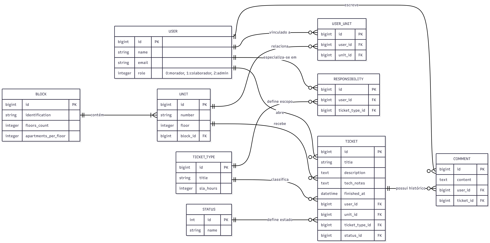

# Sistema de Gerenciamento de Chamados para Condomínio

Sistema desenvolvido como desafio técnico para a **Dunnas Tecnologia**, com foco em organização da manutenção predial, rastreabilidade de atendimentos e controle eficiente de responsabilidades.

---

## 🎯 Objetivo

Permitir que moradores registrem ocorrências em suas unidades e que a equipe técnica gerencie, acompanhe e resolva os chamados de forma estruturada, com controle de acesso, SLA e histórico completo de interações.

---

## 🧱 Tecnologias Utilizadas

* **Backend & Frontend:** Ruby on Rails 8.1 (MVC)
* **Banco de Dados:** PostgreSQL
* **Autenticação:** Devise
* **Upload de Arquivos:** Active Storage

---

## 🏗️ Arquitetura e Decisões Técnicas

### 🔐 Controle de Acesso (RBAC)

Implementado via `enum` no model `User`, com três perfis:

* **Morador:** abre chamados e acompanha seus próprios registros
* **Colaborador:** gerencia chamados dentro de sua especialidade
* **Administrador:** possui controle total do sistema

---

### 🧠 Triagem Inteligente de Chamados

A entidade `Responsibility` define as especialidades técnicas de cada colaborador, permitindo que:

* Cada técnico visualize apenas chamados do seu domínio
* O sistema filtre automaticamente os tickets no dashboard

---

### 🏢 Geração Automática de Unidades

A partir do cadastro de blocos:

* Número de andares (`floors_count`)
* Apartamentos por andar (`apartments_per_floor`)

As unidades são geradas automaticamente seguindo um padrão consistente (ex: A101).

---

### 📸 Gestão de Mídia

Utilização do **Active Storage** com separação clara:

* `attachments` → evidências do problema
* `resolution_media` → evidências da solução

---

### ⏱️ Controle de SLA

Cada tipo de chamado possui um tempo máximo (`sla_hours`).

O sistema:

* Calcula automaticamente o prazo limite
* Identifica chamados atrasados
* Registra `finished_at` ao concluir

---

### 💬 Histórico de Interações

A entidade `Comment` garante:

* Comunicação centralizada
* Registro auditável de interações
* Transparência entre moradores e equipe técnica

---

## 📊 Modelagem de Dados

A modelagem foi construída com foco em:

* Normalização
* Relacionamentos N:N
* Escalabilidade

### 🧾 Legenda

* `PK` → Chave Primária
* `FK` → Chave Estrangeira
* `||` → 1 (obrigatório)
* `o{` → 0..N (opcional/muitos)
* `|{` → 1..N

---

## 🔄 Fluxo do Sistema (Ciclo de Vida do Chamado)

1. **Abertura e Registro**
   O morador registra o chamado selecionando a categoria e a unidade, anexando fotos como evidências iniciais do problema.

2. **Triagem Automática**
   Com base na categoria (Elétrica, Hidráulica, etc.), o sistema filtra e direciona o chamado apenas para os colaboradores que possuem a especialidade técnica correspondente.

3. **Monitoramento de SLA**
   O cronômetro de prazo é iniciado automaticamente conforme o `ticket_type`, permitindo que a gestão acompanhe o tempo de resposta em tempo real.

4. **Interação e Histórico**
   Moradores e técnicos se comunicam através de um chat interno (`Comments`), mantendo todo o histórico de interações centralizado e auditável.

5. **Execução e Parecer**
   O técnico atualiza o progresso, insere notas técnicas e, ao concluir, anexa fotos do serviço realizado para validação.

6. **Gestão de Fluxo (Admin)**
   O administrador tem total controle para criar e personalizar novos `Statuses`, adaptando o sistema às necessidades específicas da operação do condomínio.

---

## 🛠️ Como Executar
1. Instale as dependências: `bundle install`
2. Prepare o ambiente: `rails db:prepare`
3. Semeie os dados iniciais: `rails db:seed`
4. Rode o servidor: `rails server`

## 🔑 Credenciais de Teste

Senha padrão: `senha123`

* Admin: `admin@email.com`
* Morador: `morador@email.com`
* Elétrica: `eletrica@email.com`
* Manutenção: `manutencao@email.com`
* Segurança: `seguranca@email.com`
* Limpeza: `limpeza@email.com`
* Financeiro: `financeiro@email.com`

---

## ✨ Diferenciais Implementados

* Controle de acesso robusto (RBAC)
* Triagem automática por especialidade
* Histórico completo de interações
* Upload de evidências (antes/depois)
* Cálculo automático de SLA
* Modelagem normalizada e escalável

---

## 📌 Considerações Finais

O sistema foi projetado com foco em clareza, escalabilidade e aderência às regras de negócio propostas, utilizando boas práticas do ecossistema Rails e modelagem relacional consistente.

---

